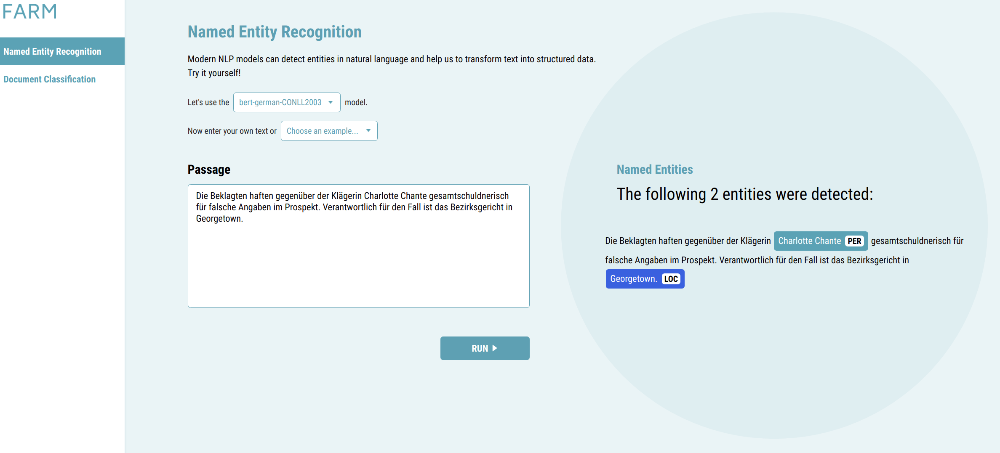

Basic Usage
############

1. Train a downstream model
****************************
FARM offers two modes for model training:

**Option 1: Run experiment(s) from config**::

    from farm.experiment import run_experiment, load_experiments
    experiments = load_experiments("experiments/ner/conll2003_de_config.json")
    run_experiment(experiments[0])

*Use cases:* Training your first model, hyperparameter optimization, evaluating a language model on multiple down-stream tasks.

**Option 2: Stick together your own building blocks**::

    # Basic building blocks for data handling
    tokenizer = BertTokenizer.from_pretrained(pretrained_model_name_or_path=lang_model)
    processor = CONLLProcessor(tokenizer=tokenizer, data_dir="../data/conll03-de", max_seq_len=128)
    ...

    # AdaptiveModel = LanguageModel + PredictionHead(s)
    language_model = Bert.load(lang_model)
    prediction_head = TokenClassificationHead(layer_dims=[768, num_labels])
    model = AdaptiveModel(language_model=language_model, prediction_heads=[prediction_head], ...)
    ...

    # Feed it to a Trainer, which keeps care of growing our model
    trainer = Trainer(optimizer=optimizer, data_silo=data_silo,
        epochs=n_epochs,
        n_gpu=1,
        warmup_linear=warmup_linear,
        evaluate_every=evaluate_every,
        device=device,
    )

    # 7. Let it grow
    model = trainer.train(model)

See this `tutorial <https://github.com/deepset-ai/FARM/blob/master/tutorials/1_farm_building_blocks.ipynb>`_ for details

*Usecases:* Custom datasets, language models, prediction heads ...

2. Run Inference (API + UI)
****************************

* Run :code:`docker-compose up`
* Open http://localhost:3000 in your browser

One docker container exposes a REST API (localhost:5000) and another one runs a simple demo UI (localhost:3000).
You can use both of them individually and mount your own models. Check out the docs for details.