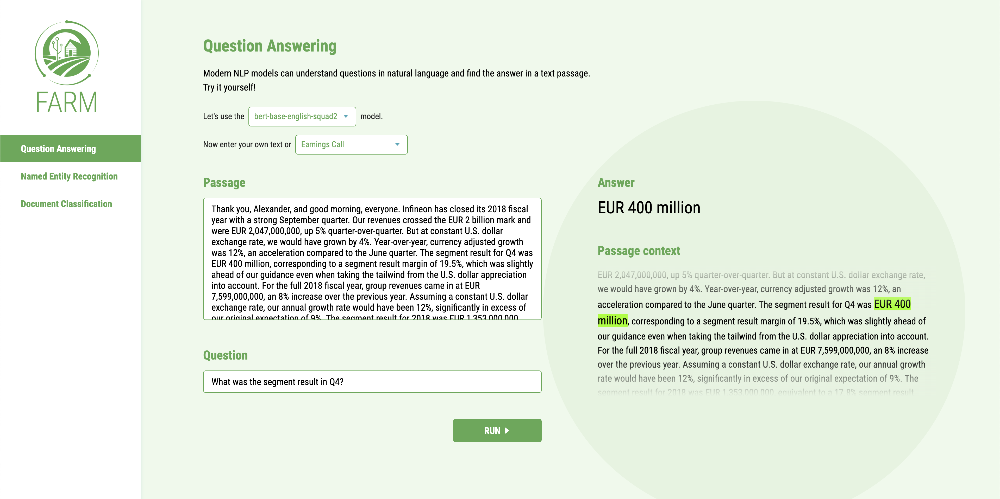

Basic Usage
############

1. Train a downstream model
****************************
FARM offers two modes for model training:

**Option 1: Run experiment(s) from config**::

    from farm.experiment import run_experiment, load_experiments
    experiments = load_experiments("experiments/ner/conll2003_de_config.json")
    run_experiment(experiments[0])

*Use cases:* Training your first model, hyperparameter optimization, evaluating a language model on multiple down-stream tasks.

**Option 2: Stick together your own building blocks**::

    # Basic building blocks for data handling
    tokenizer = Tokenizer.from_pretrained(pretrained_model_name_or_path=lang_model)
    processor = NERProcessor(tokenizer=tokenizer, data_dir="../data/conll03-de", max_seq_len=128)
    ...

    # AdaptiveModel = LanguageModel + PredictionHead(s)
    language_model = LanguageModel.load(lang_model)
    prediction_head = TokenClassificationHead(layer_dims=[768, num_labels])
    model = AdaptiveModel(language_model=language_model, prediction_heads=[prediction_head], ...)
    ...

    # Feed it to a Trainer, which keeps care of growing our model
    trainer = Trainer(optimizer=optimizer, data_silo=data_silo,
        epochs=n_epochs,
        n_gpu=1,
        warmup_linear=warmup_linear,
        evaluate_every=evaluate_every,
        device=device,
    )

    # 7. Let it grow
    model = trainer.train(model)

See this `tutorial <https://github.com/deepset-ai/FARM/blob/master/tutorials/1_farm_building_blocks.ipynb>`_ for details

*Usecases:* Custom datasets, language models, prediction heads ...

2. Run Inference (API + UI)
****************************

Quick start
===============

* Run :code:`docker-compose up`
* Open http://localhost:3000 in your browser

One docker container exposes a REST API (localhost:5000) and another one runs a simple demo UI (localhost:3000).
You can use both of them individually and mount your own models.

API Docker
==============
*(deepset/farm-inference-api)*

The API container includes FARM and is made for running trained (multiple) down-stream models in inference mode. It exposes a REST API on port 5000.

You can either start the docker via docker-compose (recommended) or manually via:
:code:`docker run -d -p 5000:5000 deepset/farm-inference-api:base-models`

**What models are loaded?**

The container is loading all models located in the docker's directory :code:`/home/user/saved_models`.
We have one image version with some exemplary models stored in this directory: :code:`farm-inference-api:base-models`.
This might be helpful if you just want to try the API/UI or compare your own model to some other baselines.
If you only want to run your own models, you can also use the smaller image with tag :code:`farm-inference-api:lastest`

**How can I add my own models?**

Just mount them from your disk into the docker directory :code:`/home/user/saved_models`.
The easiest way of doing this is to edit the :code:`docker-compose.yml`.  Just put your own path with the model folder(s)::

    volumes:
      - "./your_path/some_folder:/home/user/saved_models"

If you don't run via docker-compose you can also supply the mounted volume to :code:`docker run`::

    docker run -d \
     -p 5000:5000  \
     -v /your_path/some_folder:/home/user/saved_models \
     deepset/farm-inference-api:base-models

UI Docker
=============
*(deepset/farm-inference-ui)*

The UI container can be launched in addition to provide a frontend that queries the API exposed on port 5000 by the other container.
Start the container via docker-compose or individually via

:code:`docker run -d -p 3000:80 deepset/farm-inference-ui`

Open localhost:3000 in your browser. Then simply select the tab with your task on the left (e.g. QA), one of the models
exposed by the API and enter some text that you want to feed to the model.

