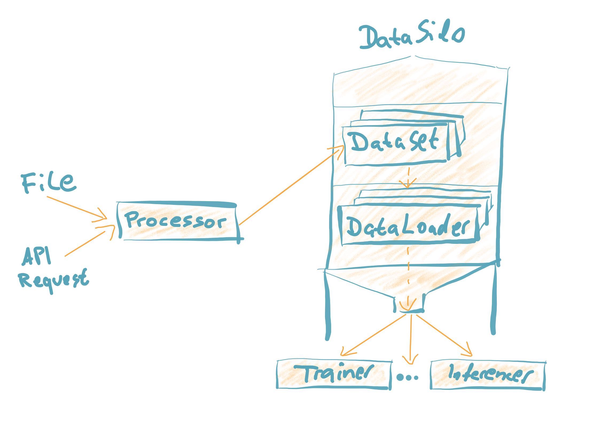
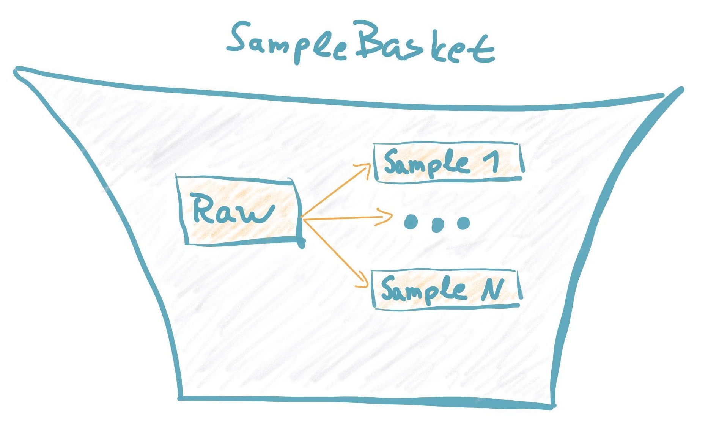

Data Handling
================================

Design Philosophy
##################
In many cases adapting a language model to your own NLP problem requires heavy lifting on the preprocessing side.
To lessen this burden, we have designed the data handling with a few goals in mind. We want:

* Customization of preprocessing components to be easy
* Inspection of the inputs and outputs of different preprocessing stages to be possible
* A structure that is general enough to handle the requirements of different NLP tasks

As such, you will find the following features in our code:

* The functions that we expect the user to customize are grouped together
* Many of the generic pipeline components are easily reusable
* There is a clear separation of generic and dataset/task/model specific components in the pipeline
* Processing goes stage by stage rather than sample by sample so that you are able to inspect the full dataset at any point in the processing
* Powerful debugging that allows inspecting a sample in different phases of the pipeline (raw, tokenized, featurized, tensors ...)

Building Blocks
#################

In FARM the **Processor** contains the functions which handle the **conversion from file or request to PyTorch Datasets**.
In essence, it prepares data to be consumed by the modelling components.
This is done in stages to allow for easier debugging.
It should be able to handle file input or requests.
This class contains everything that needs to be customized when adapting a new dataset.
Custom datasets can be handled by extending the Processor (e.g. see CONLLProcessor).

The **DataSilo** is a generic class that stores the train, dev and test data sets.
It calls upon the methods from the Processor to do the loading and then exposes a DataLoader for each set.
In cases where there is not a separate dev file, it will create one by slicing the train set.

The **Sample** and **SampleBasket** objects allow powerful debugging and logging capabilities as they store different views on the same sample (raw, tokenized, featurized ...)
The **SampleBasket** stores one string sample as well as the one or more **Samples** that that string sample might generate.
These data structures are design like this since a single document only generates one sample when performing document classification but can generate multiple samples for question answering.

