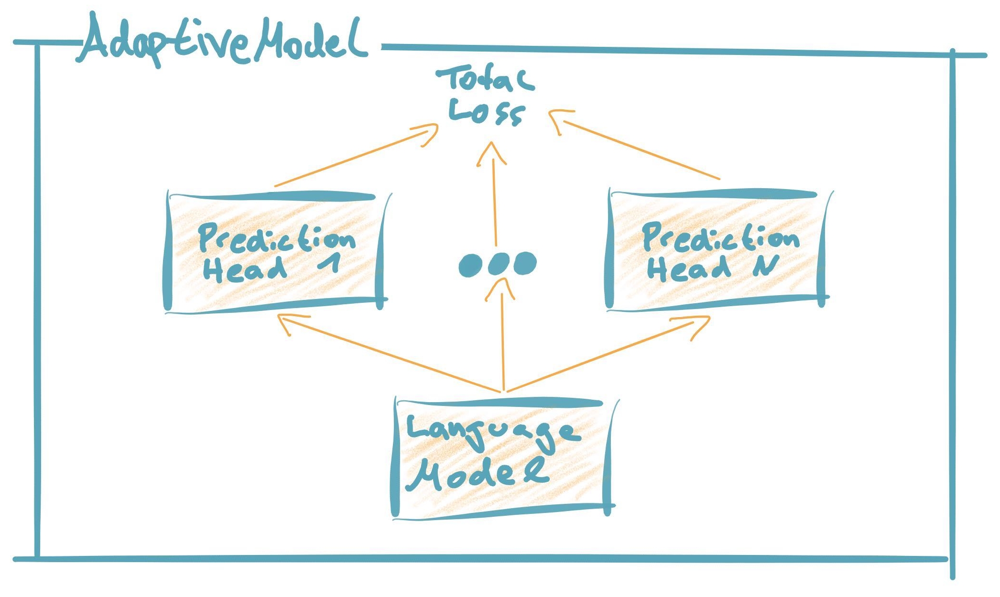

Modeling
================================

Design Philosophy
##################
We live in exciting times for NLP and see new publications on language models, adaptation strategies and down-stream applications on a weekly base.
However, keeping track with recent developments is not easy. Switching between pretrained models or adaptation strategies is not easy in practice, since most researchers publish their models in individual repos and not always have the desired down-stream tasks implemented.

FARM offer's a more flexible and general approach of transfer learning by abstracting from the underlying pretrained language models and their prediction head.
With FARM you can stick together any pretrained language model (BERT, XLNet or whatever comes next) with one or multiple prediction heads (NER, Doc classification ...) to form an AdaptiveModel.
This allows you a fast and easy comparison between different language models and simplifies changes in your production system, if you want to migrate to a new model.

Building Blocks
#################

1. Language Model
********************
* Standardized parent class for all language models out there (BERT, XLNet ...).
* A pretrained language model converts tokens to vector representations

2. Prediction Head
********************
* Standardized parent class for all types of down-stream tasks (NER, Text classification, QA ...).
* A prediction head retrieves vector representations from the language model and converts them into down-stream predictions (e.g. class probabilities)

3. AdaptiveModel
********************
* Standardized parent class for end-to-end transfer learning models
* Combines the language model with one or multiple prediction heads.
* An AdaptiveModel 1) propagates the input to the language model, it's output to the prediction head(s) and then consolidates the loss(es) / predictions. During training the loss is backpropagated through the entire neural network (incl. language model). We will soon provide further adaptation strategies here like Adapter Modules or Discriminative Finetuning.

All three classes provide standardized interfaces for all kinds of model functions like retrieving logits, loss or formatted predictions.